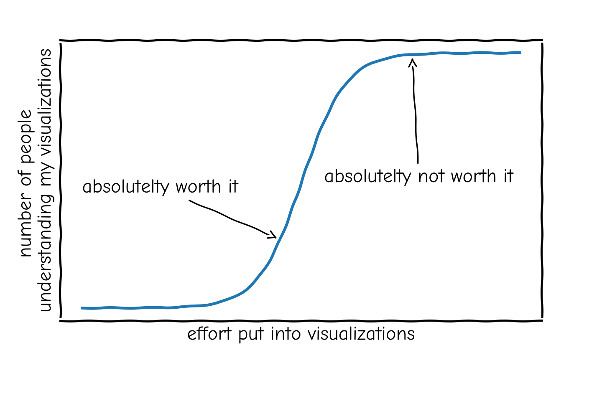
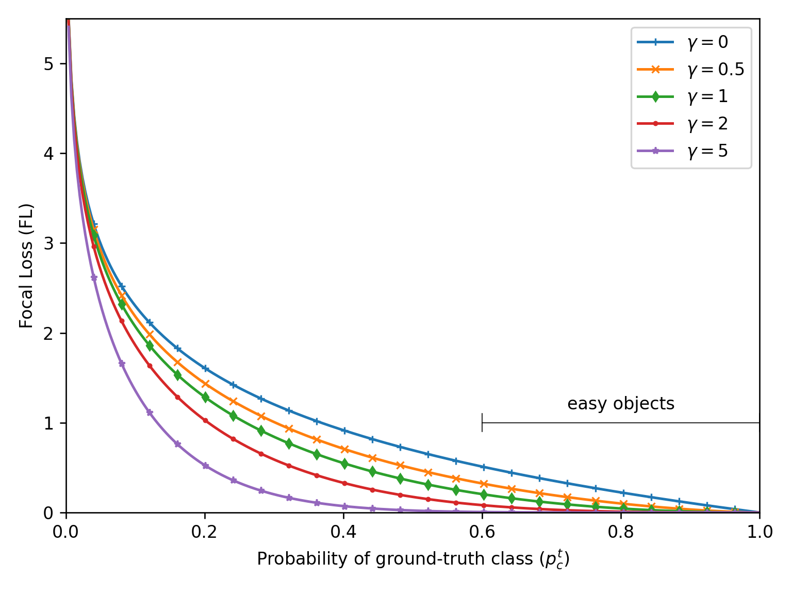
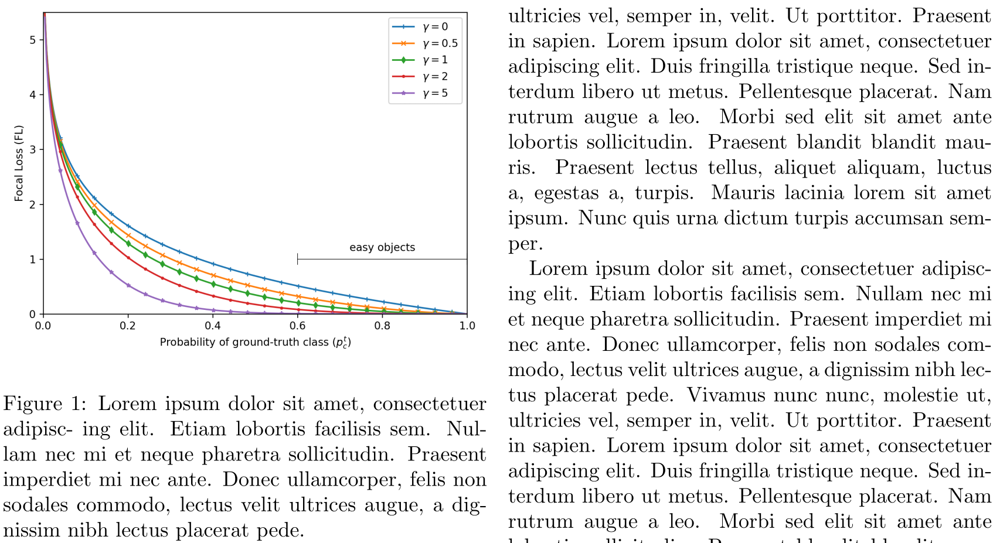
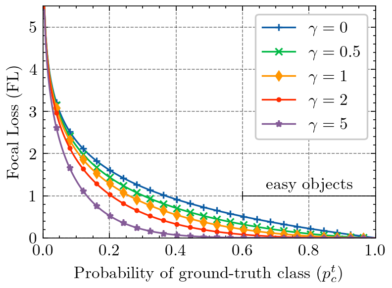
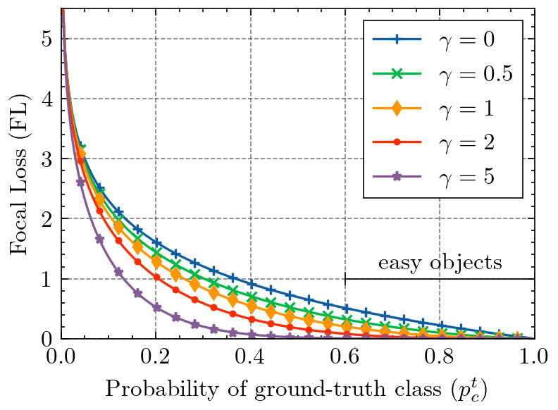
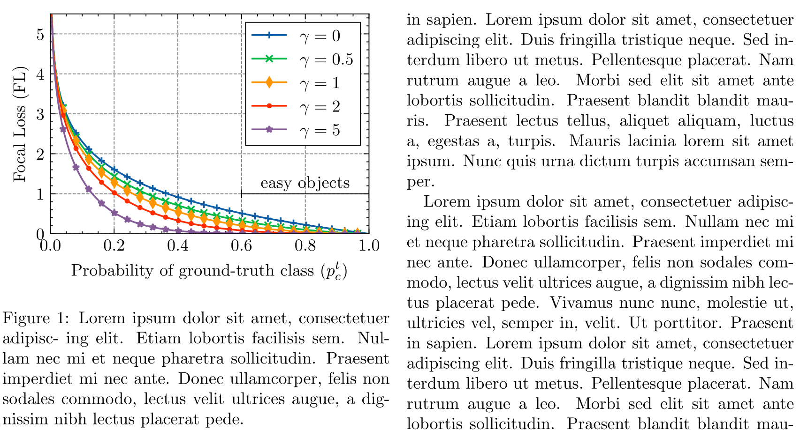

Without much talk, lets start with a matplotlib example. Let's say we want to visualize the [Focal Loss](https://arxiv.org/abs/1708.02002) objective for different values of \(\gamma\) w.r.t. the probability of the ground-truth class \(p_c^t\):



If we were to include this figure directly into some LaTeX document, it would look like this:

```latex
\documentclass[twocolumn]{article}
\usepackage{blindtext}  % Lorem ipsum filler
\usepackage{graphicx}  % includegraphics
\begin{document}

\begin{figure}
  \centering
  \includegraphics[width=\linewidth]{./base.png}
  \caption{Lorem ipsum dolor sit amet, consectetuer adipisc-
ing elit. Etiam lobortis facilisis sem. Nullam nec mi et neque
pharetra sollicitudin. Praesent imperdiet mi nec ante. Donec
ullamcorper, felis non sodales commodo, lectus velit ultrices
augue, a dignissim nibh lectus placerat pede.}
\end{figure}

% Some lipsum filler
\Blindtext
\Blindtext
\end{document}
```



Now, there are a few things that bug me: 

1. The sans-serif font used in the figure stands in contrast to the serif font
   used in LaTeX documents 
2. The figure font size is smaller than the document font size 
3. The axis grid is missing

Note, that point 2. can be okay if you need to save space and have multiple
figures next to each other. If you have enough space, you should always ensure
the same font size for all your text (including figures and tables).
Furthermore, point 3. can be omitted if the exact data/values are not important. 
For everything else, axis grids are an easy, non-intrusive hint for the reader
for a quick comparisons of values.

The easiest way to accomplish the above is to use the popular
[SciencePlots](https://github.com/garrettj403/SciencePlots) python package. It
offers multiple matplotlib styles which you can enable via:

```python
plt.style.use(["science", "grid"])
```

The resulting image, then includes grids, increased font size, and uses a serif font.



To go one step further, one can adjust the legend box frame to look consistent
with the axis frame, i.e. use `black` as color and set the linewidth to `0.5`:

```python 
legend = plt.legend(fancybox=False, edgecolor="black")
legend.get_frame().set_linewidth(0.5)
```



### Figure Size

It is helpful to adjust the figure size to the actual size available in your LaTeX document. We can find the length of `\textwidth` by adding the following statement somewhere in the source.

```latex
\printinunitsof{in}\prntlen{\textwidth}
```

This will print the `\textwidth` variable in inches at the position we have placed it in the document. For the example case with a `twocolumn` article class, this returns `3.31314` inches. We will now go ahead and make the figure size relative to this base measure by putting the height with a fixed aspect ration in direct relation to the textwidth (and enable an optional scaling factor if necessary for smaller/larger figures):

```python
textwidth = 3.31314
aspect_ratio = 6/8
scale = 1.0
width = textwidth * scale
height = width * aspect_ratio
fig = plt.figure(figsize=(width, height))
```

### PGF Outputs

If we export the figure as `.png` (or even worse: `.jpg`) file, the resulting visualization is rasterized and has fixed height and width. This can lead to, depending on the image size, pixelated results when enlarging the figure for an in-detail inspection by the reader. On the other hand, we can simply export the figure either as a `.pdf` file, or even better, use the `.pgf` (progressive graphics file) format. The big advance of `.pgf` over `.pdf` is the fact that `.pgf` has no embedded fonts and only tells the latex pgf compiler how to generate the figure from instructions. This leads to the resulting figure in the document body using the very same font for all text as the document text itself.

We can enable the `pgf` module in matplotlib with the following python preamble:

```python 
import matplotlib
matplotlib.use("pgf")
matplotlib.rcParams.update(
    {
        "pgf.texsystem": "pdflatex",
        "font.family": "serif",
        "text.usetex": True,
        "pgf.rcfonts": False,
    }
)
```

Now we save the figure in the `.pgf` format instead of the `.png` format.

```diff
- plt.savefig("fig.png")
+ plt.savefig("fig.pgf")
```

In latex, compiling `.pgf` files is provided with the `pgfplots` package.

```latex
\usepackage{pgfplots}
```

And replace the `\includegraphics` statement with an `\input` statement as follows

```diff
- \includegraphics[width=\linewidth]{fig.png}
+ \input{fig.pgf}
```

### Final Result

With this, we have addressed all issues pointed out earlier on. So let's compare this directly in the resulting LaTeX output PDF, before (left) and after (right):

<div class="img-grid">
    <div>
        
    </div>
    <div>
        
    </div>

</div>
<div class="caption">
    Before (left) and after (right) comparison when modifying a matplotlib figure to visually fit into a LaTeX document. We have now fixed the figure dimensions, text size and font, legend borders, and used the pgf format.
</div>

The updated figure now looks more polished and visually fits into the context of the LaTeX document with higher consistency. For reference, you can find the python script that generated all above figures [here](figures.py) and the LaTeX document [here](main.tex).
