This post is going to give a brief introduction to deep
models, the history of object detection ranging from classic methods
based on hand-crafted features to the latest deep learning object
detectors, object detection datasets, and object detection evaluation
metrics.

## Deep Models Preface

The construction of well performing deep models in complex computer
vision tasks is often two-fold. The primary goal is to find a model
architecture defined by a directed computation graph
\(G = \left( V, E \right)\) connecting model inputs
\(\left\{ \boldsymbol{X}_{0}, \dots, \boldsymbol{X}_{K_{\mathrm{in}}-1} \right\}\), with
\(\boldsymbol{X}_{k} \in \mathbb{R}^{d_{0} \times \dots \times d_{D_{k}-1}}\) to
nodes \(v_{i} \in V\) to model outputs
\(\left\{ \boldsymbol{Y}_{0}, \dots, \boldsymbol{Y}_{K_{out}-1} \right\}\) with
\(\boldsymbol{Y}_{k} \in \mathbb{R}^{d_{0} \times \dots \times d_{D_{k}-1}}\). Each
node \(v_{i}\) in the graph represents an operation \(f\) performed on one
or more inputs which in turn generates one or more outputs. The
operation can be arbitrary as long as it is differentiable w.r.t. each
of its input, i.e. 

$$
\frac{\partial f \left( \boldsymbol{X}_{0}, \dots, \boldsymbol{X}_{K_{in}-1} \right) }{\partial \boldsymbol{X}_{i}},\quad  0 \leq i \leq K_{\mathrm{in}}
$$

exists. These operations can be mainly divided into two groups. The
first group consists of parametric operations, i.e. the operations'
output additionally depends on a set of weights that are adjustable
during the optimization step. Prime examples for this group are fully
connected layers, which are implemented as affine transformations:

$$
  f_{linear} \left( \boldsymbol{x} ; \boldsymbol{W}\right) = \boldsymbol{x} \cdot \boldsymbol{W}, \quad
    \boldsymbol{x} \in \mathbb{R}^{D_{in}}, \quad \boldsymbol{W} \in \mathbb{R}^{D_{\mathrm{in}} \times D_{\mathrm{out}}}  ,
$$

where \(\boldsymbol{W}\) is the weights matrix (with an implicit bias encoding) that
maps the input from \(\mathbb{R}^{D_{\mathrm{in}}}\) to
\(\mathbb{R}^{D_{\mathrm{out}}}\), as well as convolution layers,
implementing the convolution (which is actually a cross-correlation)
operation with weight window, also called kernel map,
\(\boldsymbol{W} \in \mathbb{R}^{K_{H} \times K_{W}}\), with \(K_{H}\) and \(K_{W}\)
odd, over an input \(\boldsymbol{X} \in \mathbb{R}^{H \times W}\): 

$$
  f_{\text{conv2d}, m, n} \left( \boldsymbol{X} ; \boldsymbol{W} \right) = \sum_{i = - \frac{K_{H}-1}{2}}^{\frac{K_{H}-1}{2}} \sum_{j = - \frac{K_{W}-1}{2}}^{\frac{K_{W}-1}{2}} W_{\frac{K_{W}-1}{2} + i, \frac{K_{H} - 1}{2} + j} X_{m-i, n-j} \quad .
$$

Note that this operation in particular is the 2D convolution often used
in image processing which is only one of many possible convolution
operations. Other convolution operations that are commonly used include
1D and 3D convolution, as well as convolutions with stride, convolutions
with dilations, depth-wise, and separable convolutions. Parametric
operations have the additional constraint to be differentiable w.r.t.
their weights, i.e.
$$\partial f \left( \boldsymbol{X}_{0}, \dots, \boldsymbol{X}_{K_{\mathrm{in} - 1}} ; \boldsymbol{W} \right) / \partial \boldsymbol{W}$$
exists.

The second group is formed by non-parametric operations. That is,
operations that do not include any learnable weights. Common examples
for those are activation functions such as 

$$
\begin{aligned}
  \text{sigmoid} \left( x \right) &= \frac{1}{1 + e^{-x}} \\
  \text{tanh} \left( x \right) &= \frac{e^{x} - e^{-x}}{e^{x} + e^{-x}} \\
  \text{ReLU} \left( x \right) &= \text{max}(0, x)
\end{aligned}
$$ 

which are
usually used after affine transformations to achieve non-linearity.
Other common non-parametric operations are pooling, normalization
(although some normalization techniques such as Batch
Normalization [<a href="#ref-ioffe2015batchnorm">1</a>] do have learnable parameters),
dropout [<a href="#ref-hinton2014dropout">2</a>], and softmax.

The second important step in the development of deep models is the
choice of a proper loss function. The loss function \(L\), also called a
cost function, measures the overall loss of a model \(f\) in taking a
decision or action. The goal for the model is to minimize the loss value
\(L( \boldsymbol{x}, \boldsymbol{y}, f)\) for some input \(\boldsymbol{x}\) and the apriori known
ground-truth target \(\boldsymbol{y}\). This is achieved by computing the gradient
of the loss w.r.t. the weights at each node in the computation graph,
using backpropagation and optimizing the weights by taking a descent
step in the gradient direction. Simple machine learning tasks use
single-term loss functions like the cross-entropy loss for
classification or some form of distance metric such as the
mean-squared-error for regression. Other tasks may require multiple
objectives, such as regressing the coordinates of a bounding box and
classifying the object inside that box in object detection. Therefore,
loss functions can also be composed of multiple objectives, where each
objective \(i\) is represented by its loss function \(L_{i}\), weighted by
\(\lambda_{i} \in \mathbb{R}^{+}\): 

$$
  L \left( \boldsymbol{x}, \boldsymbol{y}, f \right) = \sum_{i} \lambda_{i} L_{i} \left(\boldsymbol{x}, \boldsymbol{y}, f \right) .
$$

It is common to include loss terms that are independent of the input and
output such as weight decay [<a href="#ref-krogh1991weightdecay">3</a>] applying a
regularization on the weights, encouraging the model to keep the weights
small, as well as gradient penalty [<a href="#ref-gulrajani1027gradientpenalty">4</a>] which
normalizes gradients w.r.t. the inputs, commonly found in successful
Generative Adversarial Network [<a href="#ref-Goodfellow2014">5</a>] architectures.

## Quantification of Object Detection Performance {#sec:background:evaluation}

Before we begin to dive into the methodology of object detection, the
following will shortly describe common datasets, as well as the de facto
standard metric, the *mean Average Precision* (mAP), in the field of
object detection.

### Datasets {#sec:background:evaluation:datasets}

In computer vision and machine learning in general, the quality of the
data which is used to train a model is of utmost importance. The
following section lists common datasets for horizontal object detection
and oriented object detection.

#### Horizontal Object Detection {#sec:background:evaluation:datasets:horiz-obj-det}

##### PASCAL VOC

The PASCAL Visual Object Classes (VOC) Challenges[^1] [<a href="#ref-pascal-voc">6</a>]
(2005 --- 2012) includes multiple tasks such as image classification,
object detection, semantic segmentation, and action detection. The two
most prominent datasets in use for object detection evaluation are VOC07
with 10k training images and 25k annotated objects, and VOC12 with 12k
training images and 27k annotated objects. Both datasets contain 20
different classes which are common in everyday life situations such as
persons, animals, vehicles, and indoor objects.

##### ILSVRC

The ImageNet Large Scale Visual Recognition Challenge[^2] [<a href="#ref-ILSVRC15">7</a>]
(2010 --- 2017) is a object detection challenge based on the
ImageNet [<a href="#ref-imagenet_cvpr09">8</a>] dataset. It contains 200 classes and 517k
images with 534k annotated objects beating VOC by two orders of
magnitude in scale.

##### COCO

The Common Objects in Context (COCO)[^3] [<a href="#ref-mscoco">9</a>] (2015 --- 2019) is a
large-scale object detection, segmentation, and captioning dataset with
80 object categories in 164k images (COCO17) and 897k annotated objects.
Before the Open Images Detection challenge (see below), COCO was the
most challenging object detection dataset since it contains more object
instances per image and more small objects (with a relative image area
below 1%), as well as more densely located objects than VOC and ILSVRC.

##### OID

The Open Images Detection (OID) challenge[^4] [<a href="#ref-OpenImages">10</a>] (2016 --
2020) released the largest object detection dataset to date in 2018,
consisting of 1.9M images with 16M annotations across 600 object
categories. Due to the dataset being relatively new, only very few
papers publish evaluations for OID.

#### Oriented Object Detection {#sec:background:evaluation:datasets:oriented-obj-det}

The task of oriented object detection requires ground-truth orientation
labels for each bounding box. For the above-mentioned datasets, these
can only be obtained by applying a minimum-bounding-rectangle algorithm
on the complex hull of the segmentation map of each object.
Alternatively, oriented object detection datasets have been gathered, as
listed below.

##### DOTA

The Dataset for Object Detection in Aerial Images
(DOTA) [<a href="#ref-Xia_2018_CVPR">11</a>] was released as part of the Object Detection in
Aerial Images (ODAI)[^5] challenge in early 2018. In the first version
(1.0) of the dataset, a total of 2806 images are collected from Google
Earth and vary in size between \(800 \times 800\) and \(4000 \times 4000\)
pixels, annotated by 188k objects in total. Each object instance
annotation consists of an arbitrary quadrilateral, i.e. 8 degrees of
freedom (four pairs of \(x\)- and \(y\)-coordinates), as well as one label
from a set of 15 possible object categories. While all publications on
oriented object detection evaluate on version 1.0 of DOTA, the dataset
authors have additionally published version 1.5 which introduces an
additional class and increases the number of annotations on the existing
image base to 403k.

##### HRSC2016

The High Resolution Ship Collection (HRSC)[^6] [<a href="#ref-hrsc2016">12</a>] dataset was
collected from Google Earth and consists of 1.7k satellite images. Each
image can contain multiple ships and each ship is annotated with a
5-tuple describing the pixel location, width, height, and rotation
angle. Additionally, each ship is annotated with a label for the ship
class, a specific category, and a ship type.

##### ICDAR

The International Conference on Document Analysis and Recognition
(ICDAR)[^7] offers the ICDAR2015 [<a href="#ref-icdar15">13</a>] challenge on incidental
scene text detection containing 1.7k everyday scene images. Each text
instance is annotated with a quadrilateral (8 degrees of freedom)
specifying the arbitrary bounding box and the actual text content.

##### FDDB

The Face Detection Data Set and Benchmark (FDDB)[^8] [<a href="#ref-fddbTech">14</a>] is a
dataset of faces, designed to study the problem of unconstrained face
detection. The annotations consist of 5.2k faces in 2.8k images, where
each instance is described by a 5-tuple of rotated ellipsis.

### Measuring Detection Accuracy {#sec:background:evaluation-metric}

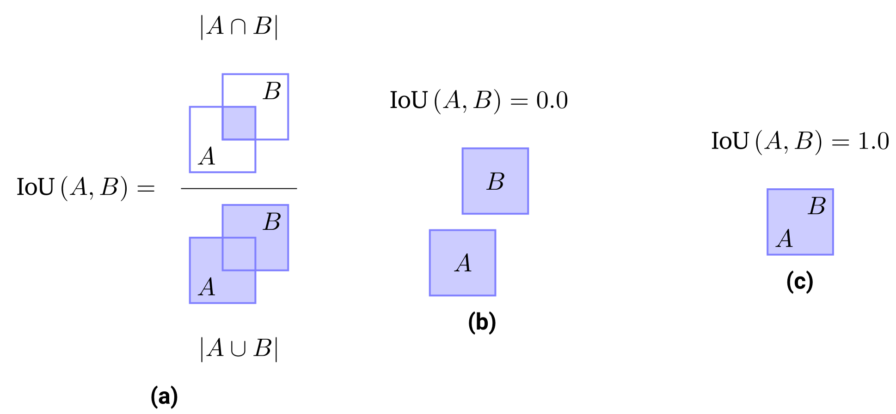

The Intersection over Union metric can be computed by measuring the
    proportion of the intersection between two bounding boxes w.r.t. their joint
    area, see (a). The IoU value ranges between \(0.0\) when
    \(A \cap B = \emptyset\) (b) and \(1.0\) when
    \(A \cap B = A \cup B\), implying that \(A = B\) (c).

The most common evaluation metric in object detection is the mean
Average Precision (mAP), originally introduced in VOC07. The mAP score
is computed as the average object detection precision, i.e. "*What
proportion of positive detections was actually successful?*", over
different recall values, i.e. "*What proportion of actual positives was
detected successfully?*", evaluated for each object class separately and
averaged afterward. The values for precision and recall can be computed
as follows: 

$$
\begin{aligned}
  \text{Precision} &= \frac{\text{TP}}{\text{TP + FP}} \\
  \text{Recall} &= \frac{\text{TP}}{\text{TP + FN}}  ,
\end{aligned}
$$

where TP is the number of true positives, while FP and FN are the
numbers of false positives and false negatives respectively. The natural
follow-up question is how a detection match and miss is decided. In a
binary classification problem, we simply check for equality between the
predicted and the target label. In the setting of object detection, the
targets and predictions consist of tuples of coordinates that define a
bounding box. Hence it is necessary to define a rule at which point the
prediction matches the target box in the two-dimensional image space.
This rule can be expressed as a hard threshold for the so-called
Intersection over Union (IoU) value which measures the relative overlap
between the two boxes \(|A \cap B|\) w.r.t. their common covered area
\(|A \cup B|\) (see Figure above): 

$$
  \text{IoU}\left( A, B \right) = \frac{|A \cap B|}{|A \cup B|}  .
$$

The IoU score ranges between a value of 0.0 when there is no overlap
between the two boxes (\(A \cap B = \emptyset\),
Figure (b)) and 1.0 when the boxes are equal
(\(A \cap B = A \cup B\),
Figure (c)). For a fixed IoU score threshold \(\tau\), we
can now count the necessary statistics to compute the precision and
recall values as follows:

-   **True Positives**: Number of predicted boxes \(A\) that fulfil
    \(\text{IoU}\left( A, B \right) \geq \tau\) for at least a single
    target box \(B\), i.e. those objects which are correctly localized.

-   **False Positives**: Number of predicted boxes \(A\) that fulfil
    \(\text{IoU}\left( A, B \right) < \tau\) for all target boxes \(B\),
    i.e. those predictions that did not sufficiently overlap with any
    target.

-   **False Negatives**: Number of target boxes \(B\) that fulfil
    \(\text{IoU}\left( A, B \right) < \tau\) for all predicted boxes \(A\),
    i.e. those targets that had no sufficient overlap with any
    prediction.

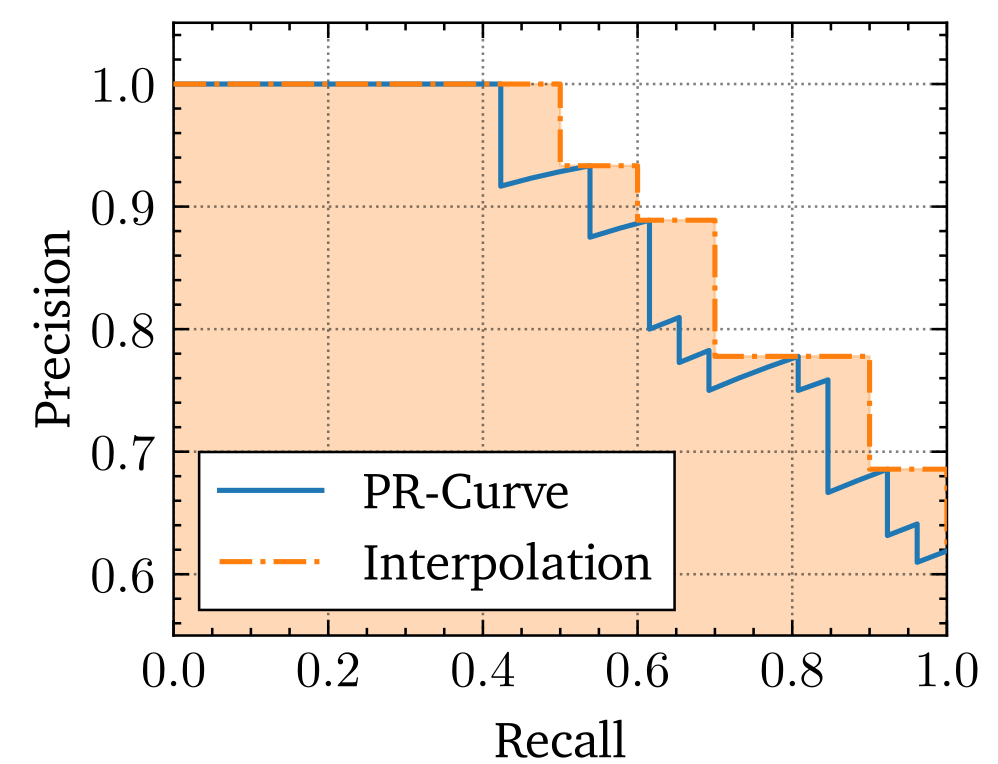

An example precision-recall curve. The blue line represents the true
    PR-Curve, while the dotted orange line is the 11-point interpolation which
    at recall point \(\tilde{r}\) uses the maximum precision value
    \(p \left( r \right)\) for all \(r \geq \tilde{r}\) with
    \(\tilde{r} \in \left\{ 0.0, 0.1, \dots, 1.0\right\}\). The Average Precision
    score is equal to the area under the 11-point interpolation of the
    precision-recall curve.

    

Following a sorting procedure of each prediction based on object
classification confidence value, we can then generate the
precision-recall curve by counting the number of TP, FP and FN
cumulatively along the confidence-ascending list of predictions as shown
with the blue line in
the above figure. The Average Precision (AP) score
reflects the area under the precision-recall curve. To be more robust
against small changes in prediction confidences and the following change
in the precision-recall curve, the area under the curve is interpolated
using an 11-point average, i.e. for each recall value \(\tilde{r}\) in the
range \(\left[ 0, 1 \right]\) with a step size of 0.1, the according
precision \(p \left( \tilde{r} \right)\) is set to be the maximum
precision over all \(r \geq \tilde{r}\): 

$$
  \text{AP} = \int_{0}^{1} p \left( r \right) dr
  \approx \frac{1}{11} \sum_{\tilde{r} \in \{0.0, 0.1, \dots, 1.0\}}
  \max_{r \geq \tilde{r}}  p \left(  r \right)
$$

The extension of the Average Precision to a multi-class problem is
called the *mean* Average Precision (mAP):

$$
  \text{mAP} = \frac{1}{|C|} \sum_{c \in C} \text{AP}_{c}  ,
$$

where \(C\) is the set of available object classes and \(\text{AP}_{c}\) is
the Average Precision score for a specific class \(c\). The IoU based mAP
score has become the prime metric for object detection evaluation.
Nevertheless, it is common to report a batch of scores for different IoU
thresholds, namely \(\text{mAP}_{0.5}\) for a 0.5-IoU threshold,
\(\text{mAP}_{0.75}\) for a 0.75-IoU threshold, and
\(\text{mAP}_{\left[0.5, 0.95\right]}\), sometimes abbreviated as mAP or
simply AP when clear from context, for an averaged mAP score over 10
equally distanced IoU thresholds between 0.5 and 0.95. Another
distinction is the separation of \(\text{mAP}\) scores into different
object sizes as is common in the COCO benchmark: \(\text{mAP}^{small}\),
\(\text{mAP}^{medium}\), and \(\text{mAP}^{large}\) are mAP values for
objects with an \(\text{area} < 32^{2}\), \(32^{2} < \text{area} < 96^{2}\),
and \(96^{2} < \text{area}\), in pixel^2^ respectively.

## A History of Object Detection {#sec:background:hist-object-detect}

As modern deep learning-based object detection borrows many techniques
from traditional approaches, it is important to quickly summarize these
before moving on to more recent ones. In an era before the prominent
rise of deep learning models in the last decade, robust image
representation optimized towards a specific task could not be simply
learned from the data but had to be handcrafted and designed
sophisticatedly. As used
in [<a href="#ref-od-framework">15</a>, <a href="#ref-trainable-system-od">16</a>, <a href="#ref-example-based-od">17</a>] and later
successfully optimized in the first real-time application for human face
detection by [<a href="#ref-Viola01rapidobject">18</a>], the basics of object detection used to be a straight
forward approach: A sliding window is used to detect object instances in
all locations and scales of an image. Each image sub-region under the
current window position is then used to compute so-called Haar-like
features (similar to Haar wavelets) and classifiers are then learned to
distinguish between positive samples, i.e. feature representations of
sub-regions which contain the object, and negative samples, those that
count towards the background and are not of interest.

    

        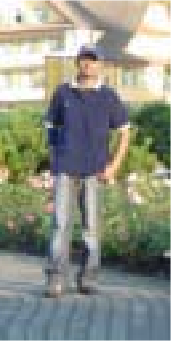
    

    

        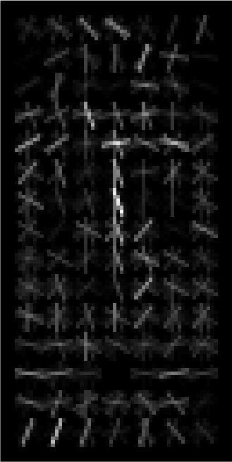
    

    

        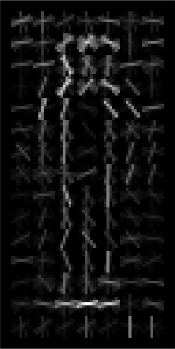
    

History of Oriented Gradients feature transformation applied on a
    test image. Left: Test image. Middle: HOG
    descriptors weighted by positive SVM weights. Right: HOG
    descriptors weighted by negative SVM weights. Source:
    [<a href="#ref-hog-features">19</a>].

Introduced in [<a href="#ref-hog-features">19</a>], Histogram of Oriented Gradients (HOG) have been
developed as an important improvement over scale-invariant feature
transform (SIFT) [<a href="#ref-sift">20</a>] descriptors. The main idea behind HOG features
is that local object shapes and appearances in an image can be expressed
as a distribution of color intensity gradients.
The above figure shows a
test image of a pedestrian in and the HOG descriptors weighted by
positive and negative Support Vector Machine (SVM) weights, which were
used to classify the presence of a pedestrian, in and respectively. HOG
features became an important foundation of many object
detectors [<a href="#ref-Felzenszwalb2008ADT">21</a>]; [<a href="#ref-5539906">22</a>]; [<a href="#ref-ens-exem-svms">23</a>], as well as
other computer vision tasks.

The peak of traditional object detection methods was reached with the
Deformable Part-based Model (DPM) proposed by , winning the VOC-07, -08,
and -09 detection challenges. It is built on the foundations of the HOG
detector and views training as the task to learn how to decompose an
object while inference is an ensemble of detections of different object
parts. Detecting a person would then be translated into the decomposed
detection of a head, legs, hands, arms, and body, which was also called
the "star-model" in [<a href="#ref-Felzenszwalb2008ADT">21</a>]. [<a href="#ref-NIPS2011_4307">24</a>] later
improved this to "mixture
models" [<a href="#ref-5539906">22</a>]; [<a href="#ref-NIPS2011_4307">24</a>]; [<a href="#ref-10.5555/2520924">25</a>], coping with
objects of larger variation.

## Deep Learning based Object Detection {#sec:background:modern-object-detect}

After the success of DPMs, improvements in object detectors stagnated.
With the comeback of convolutional neural networks (CNN) [<a href="#ref-cnn-rebirth">26</a>]
in 2012, deep architectures have been developed to learn robust and
high-level task agnostic feature representations of images that easily
superseded hand-crafted ones. Unsurprisingly, the field of object
detection has quickly gained new traction due to successful deep models.
This section goes into more detail on different approaches which can be
grouped into two-stage detectors and one-stage detectors. The former can
be split into two steps that divide the candidate region generation and
the actual location regression and object classification while the
latter implements an end-to-end solution using a single deep neural
network.

### Two-Stage Detectors {#sec:background:two-stage-detectors}

Two-stage object detectors follow a detection paradigm of a separated
(1) proposal detection step, where likely object locations are
determined and (2) a verification step, where each proposal is
classified into one of the possible classes of objects and additionally
the proposed location is fine-tuned.

##### Regions with CNN Features: R-CNN {#sec:background:regions-with-cnn}

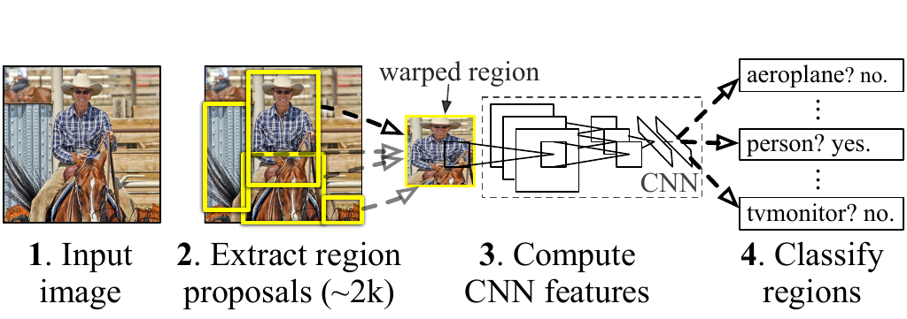

R-CNN object detection system overview. The system (1) takes an input
image, (2) extracts region proposals, (3) warps and forwards each
proposal through a pre-trained CNN to obtain feature representations and
finally (4) classifies each output using class-specific SVMs. Source: [<a href="#ref-rcnn">27</a>].

The first of its kind in the two-stage category of object detectors was
R-CNN (Regions with CNN features) by . R-CNN starts with the generation
of object proposals that serve as candidates for processing. These are
obtained using the selective search algorithm [<a href="#ref-selective-search">28</a>] which
is a region proposal procedure that computes hierarchical groupings of
similar regions based on size, shape, color, and texture. Each object
proposal is then warped into a fixed predetermined image size and
forwarded through a CNN model, which is pre-trained on ImageNet, to
extract a fixed 4096-dimensional feature vector. Afterward,
class-specific SVMs perform the object recognition task by scoring each
region proposal with their respective class. Finally, a greedy
non-maximum suppression is applied, rejecting regions of high IoU values
with other regions of the same class achieving higher SVM scores than a
learned threshold. The above figure gives a sketch of the inference pipeline.
Additionally, the CNN can be fine-tuned on other datasets. To improve
the object localization, [<a href="#ref-rcnn">27</a>] have applied a separate bounding box
regression stage (a similar strategy was introduced in [<a href="#ref-od-disc">29</a>]) that
uses class-based regressors to predict new bounding boxes based on the
CNN features. R-CNN broke the stagnation in the field of object
detection by pushing the VOC07 \(\text{mAP}_{0.5}\) score from 33.7% of
DPM-v5 [<a href="#ref-dpm-v5">30</a>] to 58.5%.

##### Fast R-CNN {#sec:background:fast-r-cnn}

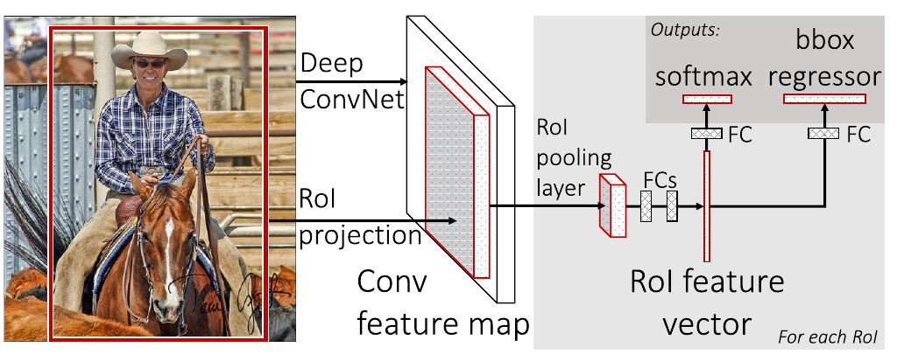

The architecture of Fast R-CNN. The full input image is fed through a
CNN to generate feature maps. Based on RoIs, each feature map is pooled
into a RoI feature vector and fed into a sequence of fully-connected
layers with a classification (object classes) and regression (object
localization) head. Source: [<a href="#ref-fast-rcnn">31</a>].

R-CNN was superseded by Fast R-CNN [<a href="#ref-fast-rcnn">31</a>]. In Fast R-CNN, the
*full* input images are forwarded through a CNN backbone to produce
features maps. For each object proposal output of the selective search
algorithm, a region of interest (RoI) pooling layer extracts a
fixed-size feature vector from the feature map, inspired by spatial
pyramid pooling in SPPNet introduced by [<a href="#ref-sppnet">32</a>]. Then, each vector is fed into
a sequence of fully-connected layers which then split into two heads,
one for softmax classification outputting a probability vector \(\boldsymbol{p}\) of
length \(|C|+1\) for the possible classes (with an additional class for
the background), and one for the bounding box regression outputting a
bounding box offset
\(\boldsymbol{t}^{c} = ( t_{x}^{c}, t_{y}^{c}, t_{w}^{c}, t_{h}^{c}, )\) for each of
the \(|C|\) object classes (see
figure above). To jointly train for classification and
bounding box regression, a multi-task loss \(L\) on each labeled RoI is
introduced: 

$$
  L\left(\boldsymbol{p}, u, \boldsymbol{t}^u , \boldsymbol{v}\right) = L_{cls}(\boldsymbol{p}, u) + \lambda\left[u \geq 1\right]L_{loc}\left(\boldsymbol{t}^u, \boldsymbol{v}\right) ,
$$

where \(u\) is the ground-truth label, \(\boldsymbol{v}\) is the ground-truth bounding
box regression target, the Iverson bracket indicator function
\([u \geq 1]\) evaluates to 1 when \(u \geq 1\) and 0 otherwise, and the
hyperparameter \(\lambda\) controls the balance between the two task
losses. For classification the binary cross-entropy loss and for
bounding box regression, the SmoothL1 loss is used to accumulate over
the coordinates. For background RoIs (\(u = 0\)) \(L_{loc}\) is ignored due
to missing ground-truth references.

This approach is closer to an end-to-end solution than its predecessors
as it gets rid of the multi-stage pipeline and can be trained given only
the input image and the object proposals coming from an off-the-shelf
algorithm. Fast R-CNN improves training time by a factor of 9 (with a
VGG16 backbone) and testing time by a factor of 213, and pushes the
\(\text{mAP}_{0.5}\) score on VOC07 to 70.0%.

##### Faster R-CNN {#sec:background:faster-r-cnn}

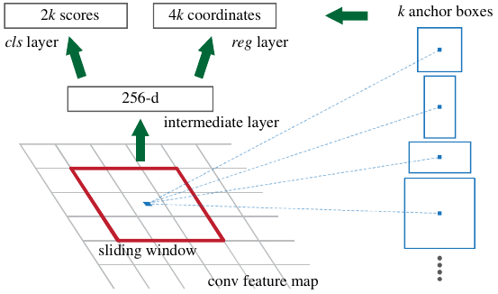

The End-to-end unified architecture of Faster R-CNN including an 'attention' module called Region Proposal Network (RPN) generating likely object proposals (location and objectness) based on \(k\) predefined anchor boxes. Source: [<a href="#ref-faster-rcnn">33</a>].

Fast R-CNN was expanded by Faster R-CNN [<a href="#ref-faster-rcnn">33</a>], replacing the
external object proposal stage with an end-to-end approach (see
figure above). [<a href="#ref-faster-rcnn">33</a>] have introduced a
so-called Region Proposal Network (RPN) serving as an "attention" model
which is a fully convolutional network that takes an image of any size
as input and predicts a set of bounding box proposals. Each proposal is
attached with an *objectness* score that measures the membership to a
set of object classes against the background class. Instead of
generating final bounding box locations of the object proposals, [<a href="#ref-faster-rcnn">33</a>] introduce the notion of *anchors*, making Faster R-CNN the
first anchor-based detector. These are used as a baseline reference box
for which an offset has to be regressed (see
figure above). Anchor-boxes are predefined with
different scales (e.g. \(32\times32\), \(64\times64\), ...) and aspect
ratios (e.g. 1:1, 1:2, 2:1, 5:1, ...). For each position in a
convolutional feature map in the RPN, a sliding window approach computes
a vector of \(2k\) objectness scores, one for the class "object" and one
for the class "background", as well as \(4k\) bounding box offsets where
\(k\) is the number of different anchors (the product of the number of
anchor scales and the number of anchor aspect ratios). Therefore, the
RPN generates \(W \cdot H \cdot k\) proposals, where the intermediate
feature map is of size \(W \times H\).

Embedding the region proposal generation into the network stack has
improved the VOC07 \(\text{mAP}_{0.5}\) to 73.2% (COCO
\(\text{mAP}_{0.5}=42.7\%\), COCO
\(\text{mAP}_{\left[0.5, 0.95\right]}=21.9\%\)). Faster R-CNNs therefore
became the first end-to-end and the first near-realtime object detector
(17fps with a ZFNet [<a href="#ref-zfnet">34</a>] backbone). Computational redundancies at
the subsequent detection stage have later been reduced in RFCN [<a href="#ref-rfcn">35</a>]
using fully convolutional networks, and Light-Head
R-CNN [<a href="#ref-Li2017LightHeadRI">36</a>] thinning out the prediction heads and
replacing the CNN backbone with smaller networks (e.g.
Xception [<a href="#ref-Chollet2017XceptionDL">37</a>]).

Faster R-CNN has been extended in Feature Pyramid Networks
(FPN) [<a href="#ref-fpns">38</a>]. Feature pyramids are a principal
component in computer vision tasks for objectives that have to be solved
at multiple scales. Until the development of FPN, deep learning-based
object detectors have been avoiding feature pyramids, mostly due to
their computational complexity and high memory usage. FPNs utilize the
inherent multi-scale hierarchy present in deep convolutional networks
and introduce feature pyramids with almost no extra cost. Instead of
only using the very last output in the convolutional layer sequence,
FPNs introduced a top-down architecture with lateral connections (see
figure above) which extracts intermediate feature maps from
another deep network (in this context called *backbone*). This
architecture allows building high-level semantics at all scales,
significantly improving scores on COCO to \(\text{mAP}_{0.5}=59.1\%\) and
\(\text{mAP}_{\left[0.5, 0.95\right]}=36.2\%\). Feature Pyramid Networks
have since become one of the basic building blocks for many newer object
detectors.

### One-Stage Detectors {#sec:background:one-stage-detectors}

In contrast to two-stage object detectors, a parallel line of
development took place with a very different approach. Instead of having
a separate stage in the network that proposes where an object is likely,
one-stage detectors predict object locations and classes on a grid that
can be mapped onto the input image in a single pass which is
methodologically simpler and computationally faster. This also allows
the object detector to be trained in a simple end-to-end fashion,
therefore optimizing the whole network in a unified way towards the
defined objective, unlike two-stage methods which usually have to define
freezing phases for different network parts with different loss
functions to achieve a stable training (see "4-Step Alternating
Training" in [<a href="#ref-faster-rcnn">33</a>].

##### You Only Look Once (YOLO) {#sec:background:you-only-look}

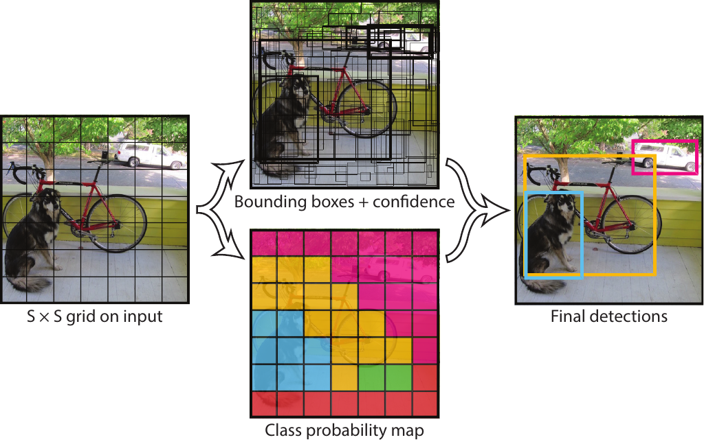

YOLO divides the input image into a grid of \(S\times S\) patches. Each
grid cell then predicts \(B\) bounding boxes, confidences for the boxes,
and \(C\) class probabilities. Source: [<a href="#ref-yolo">39</a>].

The most prominent and also first one-stage object detector was YOLOv1,
proposed by . The network separates the input image into a grid of
\(S \times S\) patches and predicts bounding boxes, object confidences,
and class probabilities for each patch at the same time (see
figure above),
reaching \(\text{mAP}_{0.5} = 63.4\%\) on VOC07. YOLOv1 was improved in
YOLOv2 [<a href="#ref-yolo-v2">40</a>], adapting anchor boxes from Faster R-CNN, achieving a
\(\text{mAP}_{0.5}\) score of 78.6% on VOC07, and
\(\text{mAP}_{0.5}=44.0\%\) and \(\text{mAP}_{[0.5,0.95]}=21.6\%\) on COCO.
It nevertheless suffered from weak localization accuracy for small
objects, which was addressed in YOLOv3 [<a href="#ref-yolo-v3">41</a>] by making use of
features from multiple scales, similar in concept to feature pyramids in
FPNs (\(\text{mAP}_{0.5} = 57.9\%\) and \(\text{mAP}_{[0.5,0.95]} = 33.0\%\)
on COCO).

##### Single Shot Detection (SSD) {#sec:background:single-shot-detect}

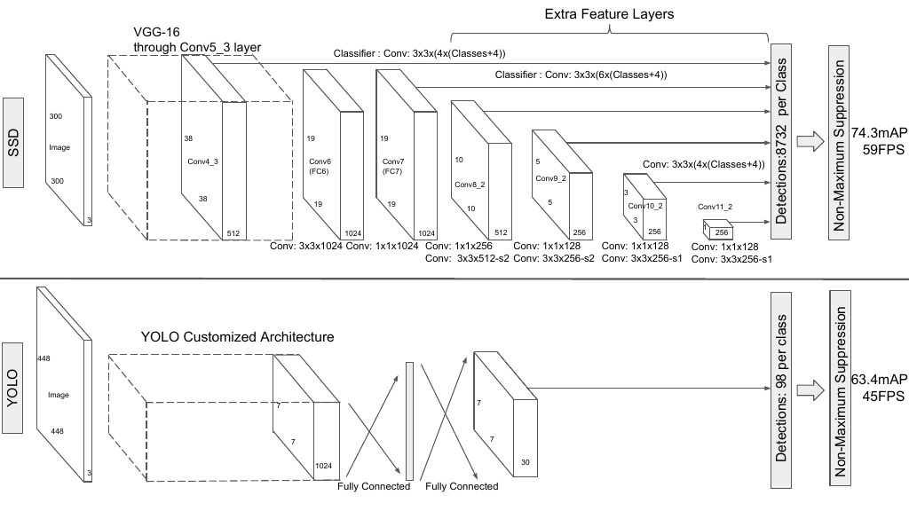

An architectural comparison of SSD (top) and YOLOv1 (bottom). SSD
works without any fully-connected layers and adds convolutional feature
layers on-top of the backbone network to predict offsets for a set of
anchor boxes at multiple feature scales. Evaluated mAP values are for
the VOC07 dataset. Source: [<a href="#ref-ssd">42</a>].

SSD, proposed by , was the second one-stage object detector after
YOLOv1. Its major contribution is using default boxes of different
scales on different intermediate feature maps instead of only using the
last layer (see figure above). Taking multiple feature scales into
account, SSD offers advantages in terms of detection speed and accuracy
over YOLOv1, especially for small objects (VOC07
\(\text{mAP}_{0.5}=76.8\%\), COCO \(\text{mAP}_{0.5}=46.5\%\), COCO
\(\text{mAP}_{\left[0.5, 0.95\right]}=26.8\%\), and a fast version running
with 59FPS VOC07 \(\text{mAP}_{0.5}=74.3\%\) depicted in
the above figure).

##### RetinaNet {#sec:background:retinanet}

In RetinaNet [<a href="#ref-retinanet">43</a>], [<a href="#ref-retinanet">43</a>] discover that one-stage detectors
have trailed two-stage detectors in terms of accuracy due to their
unmanaged class imbalance of positive and negative samples. Two-stage
detectors can use sampling heuristics such as a fixed
foreground-to-background ratio (typically 1:3), or online hard example
mining (OHEM) [<a href="#ref-ohem">44</a>] to maintain the class balance between foreground
(positive samples) and background (negative samples). Since one-stage
detectors perform a single pass and have no stage to filter possible
object proposals, they evaluate about \(10^4\) to \(10^{5}\) candidate
locations per image while only a few locations contain objects, causing
the following two issues: (1) inefficient training since most locations
are easy to pick backgrounds and do not contribute any useful learning
signal and (2) negative sample numbers overweight positives ones by a
large margin, leading to degenerate models as the training can only
adjust to few positives in comparison to negatives. To tackle this issue
in one-stage detectors, the authors propose the so-called *Focal Loss*
which represents a modified version of the cross-entropy loss. The main
idea of Focal Loss is to automatically down-weight the contribution of
easy examples during training and focus the model on hard examples with
low confidences. Using feature pyramids from FPN [<a href="#ref-fpns">38</a>] (with a
ResNeXt-101-FPN [<a href="#ref-resnext">45</a>] backbone) and anchor boxes from Faster R-CNN,
RetinaNet managed to beat previous state-of-the-art results with a COCO
mAP of 40.8%, surpassing the best one-stage detector
DSSD513 [<a href="#ref-fu2017dssd">46</a>] (with a ResNet-101-DSSD backbone) at 33.2% mAP as
well as the best two-stage detector Faster R-CNN (with an
Inception-Resnet-v2-TDM [<a href="#ref-tdm">47</a>] backbone) at 36.8% mAP.

### Anchor-Free Object Detection {#sec:background:anchor-free-object}

Although anchor-based methods have shown great success, they come with
increased methodological and computational complexity. [<a href="#ref-faster-rcnn">33</a>] show
in [<a href="#ref-faster-rcnn">33</a>] that detection performance is sensitive to anchor box
size, aspect ratio and number. Therefore, hyper-parameters need to be
additionally tuned to find anchors appropriate for the specific dataset.
Moreover, anchor-based detectors have difficulties with objects of large
shape variations, as well as small objects. The need for fine-tuning
moreover impedes the model's generalization abilities, as anchors need
to be redesigned for new tasks. Most anchor boxes are labeled as
negative samples during training since anchors are required to be placed
densely on the input image (FPN [<a href="#ref-fpns">38</a>] e.g. places 180k anchors)
leading to only a few anchors overlapping with positive samples.
Logically, the question of whether anchor-based solutions are the
optimal way to solve object detection arises. The recent field of
*anchor-free* object detection tries to find answers to this exact
question. First results show, that approaches without object anchors are
competitive and capable of beating state-of-the-art anchor-based models,
with the advantage of being faster and methodologically less complex.

Early approaches such as DenseBox [<a href="#ref-huang2015densebox">48</a>], the first
unified end-to-end fully convolutional detector, UnitBox [<a href="#ref-unitbox">49</a>]
tackling the localization with an IoU-based loss, YOLOv1 [<a href="#ref-yolo">39</a>]
focusing on real-time object detection, were made but without success in
surpassing anchor-based systems such as Faster R-CNN at that time.

CornerNet [<a href="#ref-cornernet">50</a>] approaches the bounding box prediction by
predicting a pair of keypoints, the top-left, and bottom-right corners.
The network predicts a heatmap for the top-left corner, a heatmap for
the bottom-right corner, and an embedding for each corner which is
supposed to group pairs of corners that belong to the same bounding box,
minimizing embedding vector distance between pairs. Embeddings are
produced using the Associative Embedding [<a href="#ref-NIPS2017_6822">51</a>] technique to
separate different instances. CornerNet achieves a mAP of 42.2% on COCO.
CenterNet [<a href="#ref-centernet">52</a>] builds on top of CornerNet and includes the
prediction of a center keypoint used to perform center pooling.
Additionally, CenterNet also introduces cascade corner pooling as an
extension to corner pooling from CornerNet which performs max-pooling
first along the bounding box borders and then along the orthogonal
row/column towards the region center. This addresses the problem that
CornerNet and most other one-stage detectors lack an additional look
into the cropped regions by exploring the visual patterns within each
predicted bounding box. CenterNet achieves a mAP of 47.0% on COCO,
giving a significant improvement of 4.8% mAP over CornerNet.

ExtremeNet [<a href="#ref-extremenet">53</a>] on the other hand is motivated by who proposed
to annotate bounding boxes by marking the objects' four extreme points:
top, bottom, left, right. In ExtremeNet, object extreme keypoints are
predicted as follows. First, four multi-peak heatmaps, one for each
extreme, are predicted for each object category to generate possible
extreme points. Then, each combination between a top, bottom, left, and
right extreme point is being generated and their geometric center is
being compared to a fifth heatmap that generates center keypoints. If
the geometric center is close to one of the peaks in the center heatmap
(distance above a fixed threshold), the extreme point combination is
valid and an object is predicted.

FCOS [<a href="#ref-fcos">54</a>] uses a fully convolutional one-stage detection approach
introducing the notion of *center-ness*, which depicts the normalized
distance from the location to the center of the object that the location
is responsible for. The center-ness is used to adjust the classification
confidence and thus helps to suppress low-quality detected bounding
boxes and improves overall performance by a large margin
(\(\text{mAP}_{[0.5,0.95]}\) on the COCO minival validation subset of
37.1% with, compared to 33.5% without the center-ness branch).

FoveaBox [<a href="#ref-kong2019foveabox">55</a>] is a single unified network, composed of a
backbone network and two task-specific sub-networks, following the
RetinaNet [<a href="#ref-retinanet">43</a>] design. Its main contribution is the assignment
of different object scales to different feature pyramid outputs, i.e.
each pyramid layer is responsible for a certain interval of object
sizes.

## Oriented Object Detection {#sec:background:rotat-agnos-object}

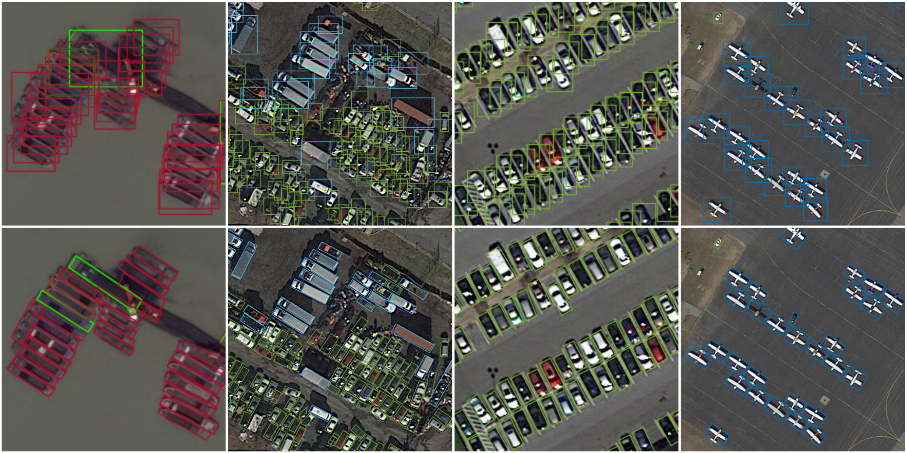

Comparison of axis-aligned (top) and oriented (bottom) bounding
    boxes in object detection on aerial view imagery. It becomes clear that the
    oriented bounding box representation is superior for oriented objects and
    generates tighter boxes that better cover the true area of the object.

Oriented object detection has recently gained more attention in computer
vision for aerial imagery, scene text, and face detection. In oriented
object detection, bounding boxes are not bound to be strictly horizontal
and vertical along the *x*- and *y*-axis but can be either rotated by an
arbitrary angle or defined by an arbitrary quadrilateral consisting of
the four corners. This allows for tighter bounding boxes, especially in
densely populated regions as well as for objects that are not parallel
to the physical *x-y* plane, where *x* is the horizontal and *y* is the
vertical axis.
The above figure shows the effect of using oriented
bounding boxes, compared to horizontal bounding boxes. The top row shows
axis-aligned bounding boxes on ships, vehicles, and airplanes in aerial
view imagery while the bottom row shows their respective oriented
bounding boxes. It is clear that the oriented bounding box
representation is superior for oriented objects and generates tighter
boxes that better cover the true area of the object.

#### Two-Stage Detectors {#two-stage-detectors}

Since this field has only recently received more attention, current
approaches are usually based on methods that are successful in
horizontal object detection. A straightforward approach to tackle
oriented object detection is to extend the prediction of a bounding box
with an additional parameter \(\theta\), determining the rotation angle.
did so by using a similar network as Faster R-CNN, expanding the
bounding box priors by multi-angle anchors including rotations between
0\(^{\circ}\) and 180\(^{\circ}\), thus increasing the anchor hyperparameter
set significantly. Similarly, propose Rotation Region Proposal Networks
(RRPN), adapting the Region Proposal Network from Faster R-CNN, designed
to generate RoIs with angle rotation information.

Inspired by Mask R-CNN [<a href="#ref-mask-rcnn">56</a>], proposed a semantic
segmentation-guided RPN (sRPN) using the atrous spatial pyramid pooling
(ASPP) module from [<a href="#ref-Chen2017RethinkingAC">57</a>] to suppress background
clutter and a RoI module that fuses multi-level outputs from an FPN.
Similarly, SCRDet++ [<a href="#ref-yang2020scrdet">58</a>] introduced the idea of
instance-level denoising on the feature maps into object detection to
enhance the detection of small and cluttered objects, common in
satellite images.

RoI Transformer [<a href="#ref-roi-trans">59</a>] is another two-stage anchor-based detector
where the geometric transformation from horizontal bounding boxes to
oriented bounding boxes is learned and applied to the RoI output of an
RPN, such as in Faster R-CNN.

argue that a five-point representation of oriented bounding boxes can
cause training instability as well as performance decreases. They
ascribe this to the loss discontinuity which results from the natural
periodicity of angles and therefore possible exchanges of width and
height in the box representation. To circumvent this discontinuity, [<a href="#ref-qian2019learning">60</a>] propose to use the quadrilateral representation in
combination with a loss modulation that greedily minimizes the loss from
the set of possible edge assignments.

#### One-Stage Detectors {#one-stage-detectors}

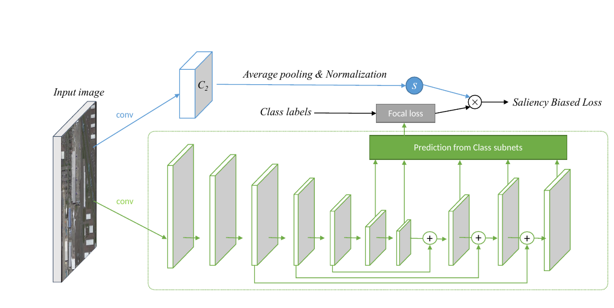

Salience Biased Loss [<a href="#ref-sun2018salience">61</a>] model architecture. The lower
network part (green) is the RetinaNet backbone generating multiscale
feature maps while the upper part (blue) is a second network which
estimates the salience maps used to adapt the focal loss to the
difficulty of the current image. Source: [<a href="#ref-sun2018salience">61</a>].

Similar to [<a href="#ref-retinanet">43</a>], [<a href="#ref-sun2018salience">61</a>] propose a novel loss function based on salience
information directly extracted from the input image. Like the Focal
Loss, the proposed Salience Biased Loss (SBL)
treats training samples differently according to the complexity
(saliency) of an image. This is estimated by an additional deep model
trained on ImageNet [<a href="#ref-imagenet_cvpr09">8</a>] in which the number of active
neurons across different convolution layers are measured (see
figure above): 

$$
  S = \frac{1}{C \cdot W \cdot H} \sum_{c=1}^{C} \sum_{w=1}^{W}
  \sum_{h=1}^{H} f\left( \boldsymbol{x} \right)_{c,w,h}  ,
$$ 

where
\(S\) is the average activation value across the layer and \(f\) is a
convolution operation with an output feature map of size
\(C \times W \times H\). The idea is that with increasing complexity, more
neurons will be active. The saliency then scales an arbitrary base loss
function to adapt the importance of training samples accordingly.

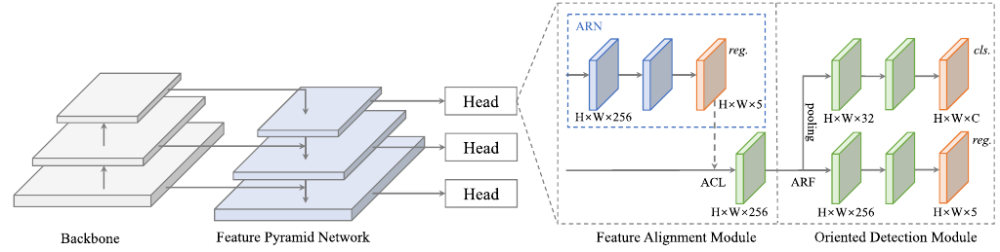

Architecture illustration of S2A-Net consisting of a backbone
pretrained on ImageNet, the Feature Pyramid Network to extract
multiscale features, the Feature Alignment Module to generate oriented
anchors using aligned convolutions and the Oriented Detection Module
using Active Rotating Filters. Source: [<a href="#ref-han2020align">62</a>].

Han et al. [<a href="#ref-han2020align">62</a>] approach to solve the discrepancy of classifications score and
localization accuracy and ascribe this issue to the misalignment between
anchor boxes and the axis-aligned convolutional features. Hence they
propose two modules (see
the figure above for the full
architecture): The Feature Alignment Module (FAM) generates high quality
oriented anchors using their Anchor Refinement Network (ARN) and
adaptively aligns the convolutional features according to the generated
anchors using an Alignment Convolution Layer (ACL).

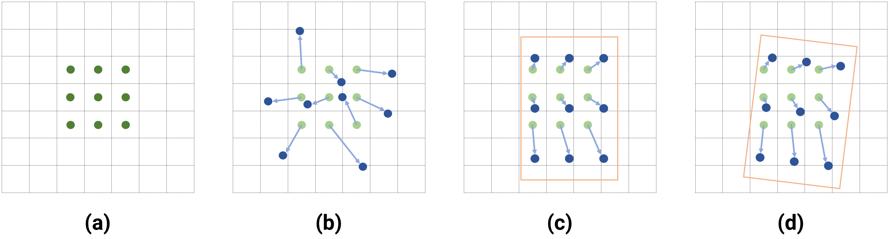

Sampling locations of different convolution operations using a
\(3 \times 3\) kernel. Figure (a) is the default convolution while (b) portrays
deformable convolutions [<a href="#ref-deform-conv">63</a>], enabling learnable sampling
offsets for each of the 9 locations. Figure (c) and (d) are aligned
convolutions (AlignConv) which in turn are deformable convolutions but
restricted to a global translation, rotation and scaling w.r.t. the full
sampling window and are supposed to align the convolution operation to
oriented anchor boxes. Source: [<a href="#ref-han2020align">62</a>].

The ACL is a restricted Deformable Convolution Layer [<a href="#ref-deform-conv">63</a>] in
the sense that it learns the same translation, scaling, and rotation for
each sampling location (see
figure above). The second proposed module
is the so-called Oriented Detection Module (ODM). Introduced in Oriented
Response Networks (ORN) [<a href="#ref-orn">64</a>], [<a href="#ref-han2020align">62</a>] make use of Active
Rotating Filters (ARF) which is a \(k \times k \times N\) convolutional
filter that rotates the features \(N - 1\) times, generating an output
feature map of \(N\) orientation channels, thereby encoding \(N\)
orientations directly into the feature maps.

In [<a href="#ref-yang2020arbitrary">65</a>], the authors tackle the issue of
discontinuous boundary effects on the loss due to the inherent angular
periodicity and corner ordering by transforming the angular prediction
task from a regression problem into a classification problem. They
devise the Circular Smooth Label (CSL) technique which handles the
periodicity of angles and raises the error lenience to adjacent angles.

#### One-Stage Anchor-Free Detectors

The following contributions go one step further and remove the concept
of anchors, generating predictions on a dense grid over the input image.

IENet [<a href="#ref-lin2019ienet">66</a>] is based on the one-stage anchor-free fully convolutional
detector FCOS. The regression head from FCOS is extended in IENet by
another branch that regresses the bounding box orientation, using a
self-attention mechanism that incorporates the branch feature maps of
the object classification and box regression branches.

Axis-Learning [<a href="#ref-xiao2020axis">67</a>] also builds on the dense sampling approach of FCOS and explore the
prediction of an object axis, defined by its head point and tail point
of the object along its elongated side (which can lead to ambiguity for
near-square objects). The axis is extended by a width prediction which
is interpreted to be orthogonal to the object axis.

In PIoU [<a href="#ref-chen2020piou">68</a>] the authors argue, that a distance-based
regression loss such as SmoothL1 only loosely correlates to the actual
IoU measurement, especially in the case of large aspect ratios.
Therefore, they propose a novel Pixels-IoU (PIoU) loss, which exploits
the IoU for optimization by pixelwise sampling, improving detection
performance on objects with large aspect ratios dramatically.

P-RSDet [<a href="#ref-zhou2020objects">69</a>] replaces the Cartesian coordinate
representation of bounding boxes with polar coordinates. Therefore, the
bounding box regression happens by predicting the object's center point,
a polar radius, and two polar angles. Furthermore, to express the
geometric constraint relationship between the polar radius and the polar
angles, a novel Polar Ring Area Loss is proposed.

An alternative formulation of the bounding box representation is defined
in O2-DNet [<a href="#ref-wei2020o2-dnet">70</a>]. Here, oriented objects are detected by
predicting a pair of middle lines inside each target, showing similarity
to the extreme keypoint detection schema proposed in ExtremeNet.

[^1]: <http://host.robots.ox.ac.uk/pascal/VOC/>, accessed 2021-04-10

[^2]: <http://image-net.org/challenges/LSVRC/>, accessed 2021-04-10

[^3]: <http://cocodataset.org/>, accessed 2021-04-10

[^4]: <https://storage.googleapis.com/openimages/web/index.html>,
    accessed 2021-04-10

[^5]: <https://captain-whu.github.io/ODAI/>, accessed 2021-04-10

[^6]: <https://www.kaggle.com/guofeng/hrsc2016>, accessed 2021-04-10

[^7]: <https://iapr.org/archives/>, accessed 2021-04-10

[^8]: <http://vis-www.cs.umass.edu/fddb/>, accessed 2021-04-10

## References

<ol class="references">
<li id="ref-ioffe2015batchnorm">Sergey Ioffe, Christian Szegedy. <em>Batch Normalization: Accelerating Deep Network Training by Reducing Internal Covariate Shift</em>. Proceedings of the 32nd International Conference on Machine Learning, 2015.</li>
<li id="ref-hinton2014dropout">Nitish Srivastava, Geoffrey Hinton, Alex Krizhevsky, Ilya Sutskever, Ruslan Salakhutdinov. <em>Dropout: A Simple Way to Prevent Neural Networks from Overfitting</em>. Journal of Machine Learning Research, 2014.</li>
<li id="ref-krogh1991weightdecay">Anders Krogh, John A Hertz. <em>A Simple Weight Decay Can Improve Generalization</em>. Proceedings of the 4th International Conference on Neural Information Processing Systems, 1991.</li>
<li id="ref-gulrajani1027gradientpenalty">Ishaan Gulrajani, Faruk Ahmed, Martin Arjovsky, Vincent Dumoulin, Aaron C Courville. <em>Improved Training of Wasserstein GANs</em>. Advances in Neural Information Processing Systems, 2017.</li>
<li id="ref-Goodfellow2014">Ian J Goodfellow, Jean Pouget-Abadie, Mehdi Mirza, Bing Xu, David Warde-Farley, Sherjil Ozair, et al. <em>Generative Adversarial Nets</em>. Neural Information Processing Systems (NeurIPS), 2014.</li>
<li id="ref-pascal-voc">Mark Everingham, Luc Gool, Christopher K Williams, John Winn, Andrew Zisserman. <a href="https://doi.org/10.1007/s11263-009-0275-4">The Pascal Visual Object Classes (VOC) Challenge</a>. Int. J. Comput. Vision, 2010.</li>
<li id="ref-ILSVRC15">Olga Russakovsky, Jia Deng, Hao Su, Jonathan Krause, Sanjeev Satheesh, Sean Ma, et al. <a href="https://doi.org/10.1007/s11263-015-0816-y">ImageNet Large Scale Visual Recognition Challenge</a>. International Journal of Computer Vision (IJCV), 2015.</li>
<li id="ref-imagenet_cvpr09">J Deng, W Dong, R Socher, L.-J. Li, K Li, L Fei-Fei. <em>ImageNet: A Large-Scale Hierarchical Image Database</em>. Proc. of CVPR, 2009.</li>
<li id="ref-mscoco">Tsung-Yi Lin, Michael Maire, Serge Belongie, James Hays, Pietro Perona, Deva Ramanan, et al. <em>Microsoft COCO: Common Objects in Context</em>. Computer Vision – ECCV 2014, 2014.</li>
<li id="ref-OpenImages">Alina Kuznetsova, Hassan Rom, Neil Alldrin, Jasper Uijlings, Ivan Krasin, Jordi Pont-Tuset, et al. <em>The Open Images Dataset V4: Unified image classification, object detection, and visual relationship detection at scale</em>. IJCV, 2020.</li>
<li id="ref-Xia_2018_CVPR">Gui-Song Xia, Xiang Bai, Jian Ding, Zhen Zhu, Serge Belongie, Jiebo Luo, et al. <em>DOTA: A Large-Scale Dataset for Object Detection in Aerial Images</em>. Proc. of CVPR, 2018.</li>
<li id="ref-hrsc2016">Zikun Liu, Liu Yuan, Lubin Weng, Yiping Yang. <a href="https://doi.org/10.5220/0006120603240331">A High Resolution Optical Satellite Image Dataset for Ship Recognition and Some New Baselines</a>. 2017.</li>
<li id="ref-icdar15">Dimosthenis Karatzas, Lluis Gomez-Bigorda, Anguelos Nicolaou, Suman Ghosh, Andrew Bagdanov, Masakazu Iwamura, et al. <a href="https://doi.org/10.1109/ICDAR.2015.7333942">ICDAR 2015 Competition on Robust Reading</a>. Proceedings of the 2015 13th International Conference on Document Analysis and Recognition (ICDAR), 2015.</li>
<li id="ref-fddbTech">Vidit Jain, Erik Learned-Miller. <em>FDDB: A Benchmark for Face Detection in Unconstrained Settings</em>. 2010.</li>
<li id="ref-od-framework">C P Papageorgiou, M Oren, T Poggio. <em>A general framework for object detection</em>. Sixth International Conference on Computer Vision (IEEE Cat. No. 98CH36271), 1998.</li>
<li id="ref-trainable-system-od">Constantine Papageorgiou, Tomaso Poggio. <a href="https://doi.org/10.1023/A:1008162616689">A Trainable System for Object Detection</a>. International Journal of Computer Vision, 2000.</li>
<li id="ref-example-based-od">Anuj Mohan, Constantine Papageorgiou, Tomaso Poggio. <a href="https://doi.org/10.1109/34.917571">Example-Based Object Detection in Images by Components</a>. IEEE Trans. Pattern Anal. Mach. Intell., 2001.</li>
<li id="ref-Viola01rapidobject">Paul Viola, Michael Jones. <em>Rapid object detection using a boosted cascade of simple features</em>. CVPR, 2001.</li>
<li id="ref-hog-features">N Dalal, B Triggs. <em>Histograms of oriented gradients for human detection</em>. 2005 IEEE Computer Society Conference on Computer Vision and Pattern Recognition (CVPR'05), 2005.</li>
<li id="ref-sift">David G Lowe. <em>Distinctive image features from scale-invariant keypoints</em>. International journal of computer vision, 2004.</li>
<li id="ref-Felzenszwalb2008ADT">Pedro F Felzenszwalb, David A McAllester, Deva Ramanan. <em>A discriminatively trained, multiscale, deformable part model</em>. 2008 IEEE Conference on Computer Vision and Pattern Recognition, 2008.</li>
<li id="ref-5539906">P F Felzenszwalb, R B Girshick, D McAllester. <em>Cascade object detection with deformable part models</em>. 2010 IEEE Computer Society Conference on Computer Vision and Pattern Recognition, 2010.</li>
<li id="ref-ens-exem-svms">T Malisiewicz, A Gupta, A A Efros. <em>Ensemble of exemplar-SVMs for object detection and beyond</em>. 2011 International Conference on Computer Vision, 2011.</li>
<li id="ref-NIPS2011_4307">Ross B Girshick, Pedro F Felzenszwalb, David A McAllester. <em>Object Detection with Grammar Models</em>. Advances in Neural Information Processing Systems 24, 2011.</li>
<li id="ref-10.5555/2520924">Ross Brook Girshick. <em>From Rigid Templates to Grammars: Object Detection with Structured Models</em>. University of Chicago, 2012.</li>
<li id="ref-cnn-rebirth">Alex Krizhevsky, Ilya Sutskever, Geoffrey E Hinton. <a href="https://doi.org/10.1145/3065386">ImageNet Classification with Deep Convolutional Neural Networks</a>. Commun. ACM, 2017.</li>
<li id="ref-rcnn">R Girshick, J Donahue, T Darrell, J Malik. <em>Rich Feature Hierarchies for Accurate Object Detection and Semantic Segmentation</em>. 2014 IEEE Conference on Computer Vision and Pattern Recognition, 2014.</li>
<li id="ref-selective-search">K E A van de Sande, J R R Uijlings, T Gevers, A W M Smeulders. <em>Segmentation as selective search for object recognition</em>. 2011 International Conference on Computer Vision, 2011.</li>
<li id="ref-od-disc">P F Felzenszwalb, R B Girshick, D McAllester, D Ramanan. <em>Object Detection with Discriminatively Trained Part-Based Models</em>. IEEE Transactions on Pattern Analysis and Machine Intelligence, 2010.</li>
<li id="ref-dpm-v5">R B Girshick, P F Felzenszwalb, D McAllester. <em>Discriminatively Trained Deformable Part Models, Release 5</em>. http://people.cs.uchicago.edu/\~rbg/latent-release5/.</li>
<li id="ref-fast-rcnn">R Girshick. <em>Fast R-CNN</em>. 2015 IEEE International Conference on Computer Vision (ICCV), 2015.</li>
<li id="ref-sppnet">Kaiming He, Xiangyu Zhang, Shaoqing Ren, Jian Sun. <em>Spatial Pyramid Pooling in Deep Convolutional Networks for Visual Recognition</em>. Computer Vision – ECCV 2014, 2014.</li>
<li id="ref-faster-rcnn">Shaoqing Ren, Kaiming He, Ross Girshick, Jian Sun. <em>Faster R-CNN: Towards Real-Time Object Detection with Region Proposal Networks</em>. Proc. of NeurIPS, 2015.</li>
<li id="ref-zfnet">Matthew D Zeiler, Rob Fergus. <em>Visualizing and Understanding Convolutional Networks</em>. Computer Vision – ECCV 2014, 2014.</li>
<li id="ref-rfcn">Jifeng Dai, Yi Li, Kaiming He, Jian Sun. <em>R-FCN: Object Detection via Region-Based Fully Convolutional Networks</em>. Proceedings of the 30th International Conference on Neural Information Processing Systems, 2016.</li>
<li id="ref-Li2017LightHeadRI">Zeming Li, Chao Peng, Gang Yu, Xiangyu Zhang, Yangdong Deng, Jian Sun. <em>Light-Head R-CNN: In Defense of Two-Stage Object Detector</em>. 2017.</li>
<li id="ref-Chollet2017XceptionDL">François Chollet. <em>Xception: Deep Learning with Depthwise Separable Convolutions</em>. 2017 IEEE Conference on Computer Vision and Pattern Recognition (CVPR), 2017.</li>
<li id="ref-fpns">T Lin, P Dollár, R Girshick, K He, B Hariharan, S Belongie. <em>Feature Pyramid Networks for Object Detection</em>. Proc. of CVPR, 2017.</li>
<li id="ref-yolo">J Redmon, S Divvala, R Girshick, A Farhadi. <em>You Only Look Once: Unified, Real-Time Object Detection</em>. Proc. of CVPR, 2016.</li>
<li id="ref-yolo-v2">J Redmon, A Farhadi. <em>YOLO9000: Better, Faster, Stronger</em>. Proc. of CVPR, 2017.</li>
<li id="ref-yolo-v3">Joseph Redmon, Ali Farhadi. <em>YOLOv3: An Incremental Improvement</em>. 2018.</li>
<li id="ref-ssd">Wei Liu, Dragomir Anguelov, Dumitru Erhan, Christian Szegedy, Scott E Reed, Cheng-Yang Fu, et al. <em>SSD: Single Shot MultiBox Detector</em>. Proc. of ECCV, 2016.</li>
<li id="ref-retinanet">T Lin, P Goyal, R Girshick, K He, P Dollár. <em>Focal Loss for Dense Object Detection</em>. IEEE Trans. on Pattern Analysis and Machine Intelligence, 2020.</li>
<li id="ref-ohem">A Shrivastava, A Gupta, R Girshick. <em>Training Region-Based Object Detectors with Online Hard Example Mining</em>. 2016 IEEE Conference on Computer Vision and Pattern Recognition (CVPR), 2016.</li>
<li id="ref-resnext">S Xie, R Girshick, P Dollár, Z Tu, K He. <em>Aggregated Residual Transformations for Deep Neural Networks</em>. 2017 IEEE Conference on Computer Vision and Pattern Recognition (CVPR), 2017.</li>
<li id="ref-fu2017dssd">Cheng-Yang Fu, Wei Liu, Ananth Ranga, Ambrish Tyagi, Alexander C Berg. <em>DSSD : Deconvolutional Single Shot Detector</em>. 2017.</li>
<li id="ref-tdm">Abhinav Shrivastava, Rahul Sukthankar, Jitendra Malik, Abhinav Gupta. <em>Beyond Skip Connections: Top-Down Modulation for Object Detection</em>. 2017.</li>
<li id="ref-huang2015densebox">Lichao Huang, Yi Yang, Yafeng Deng, Yinan Yu. <em>DenseBox: Unifying Landmark Localization with End to End Object Detection</em>. 2015.</li>
<li id="ref-unitbox">Jiahui Yu, Yuning Jiang, Zhangyang Wang, Zhimin Cao, Thomas Huang. <a href="https://doi.org/10.1145/2964284.2967274">UnitBox: An Advanced Object Detection Network</a>. Proc. of ACM International Conference on Multimedia, 2016.</li>
<li id="ref-cornernet">Hei Law, Jia Deng. <a href="https://doi.org/10.1007/s11263-019-01204-1">CornerNet: Detecting Objects as Paired Keypoints</a>. International Journal of Computer Vision, 2019.</li>
<li id="ref-NIPS2017_6822">Alejandro Newell, Zhiao Huang, Jia Deng. <em>Associative Embedding: End-to-End Learning for Joint Detection and Grouping</em>. Advances in Neural Information Processing Systems 30, 2017.</li>
<li id="ref-centernet">K Duan, S Bai, L Xie, H Qi, Q Huang, Q Tian. <em>CenterNet: Keypoint Triplets for Object Detection</em>. Proc. of ICCV, 2019.</li>
<li id="ref-extremenet">Xingyi Zhou, Jiacheng Zhuo, Philipp Krähenbühl. <em>Bottom-up Object Detection by Grouping Extreme and Center Points</em>. Proc. of CVPR, 2019.</li>
<li id="ref-fcos">Zhi Tian, Chunhua Shen, Hao Chen, Tong He. <em>FCOS: Fully Convolutional One-Stage Object Detection</em>. Proc. of ICCV, 2019.</li>
<li id="ref-kong2019foveabox">Tao Kong, Fuchun Sun, Huaping Liu, Yuning Jiang, Jianbo Shi. <em>FoveaBox: Beyond Anchor-based Object Detector</em>. 2019.</li>
<li id="ref-mask-rcnn">K He, G Gkioxari, P Dollár, R Girshick. <em>Mask R-CNN</em>. Proc. of ICCV, 2017.</li>
<li id="ref-Chen2017RethinkingAC">Liang-Chieh Chen, George Papandreou, Florian Schroff, Hartwig Adam. <em>Rethinking Atrous Convolution for Semantic Image Segmentation</em>. 2017.</li>
<li id="ref-yang2020scrdet">Xue Yang, Junchi Yan, Xiaokang Yang, Jin Tang, Wenlong Liao, Tao He. <em>SCRDet++: Detecting Small, Cluttered and Rotated Objects via Instance-Level Feature Denoising and Rotation Loss Smoothing</em>. 2020.</li>
<li id="ref-roi-trans">J Ding, N Xue, Y Long, G Xia, Q Lu. <em>Learning RoI Transformer for Oriented Object Detection in Aerial Images</em>. Proc. of CVPR, 2019.</li>
<li id="ref-qian2019learning">Wen Qian, Xue Yang, Silong Peng, Yue Guo, Chijun Yan, Junchi Yan. <em>Learning Modulated Loss for Rotated Object Detection</em>. Proc. of AAAI, 2019.</li>
<li id="ref-sun2018salience">Peng Sun, Guang Chen, Guerdan Luke, Yi Shang. <em>Salience Biased Loss for Object Detection in Aerial Images</em>. 2018.</li>
<li id="ref-han2020align">Jiaming Han, Jian Ding, Jie Li, Gui-Song Xia. <a href="https://doi.org/10.1109/TGRS.2021.3062048">Align Deep Features for Oriented Object Detection</a>. IEEE Trans. on Geoscience and Remote Sensing, 2021.</li>
<li id="ref-deform-conv">J Dai, H Qi, Y Xiong, Y Li, G Zhang, H Hu, et al. <a href="https://doi.org/10.1109/ICCV.2017.89">Deformable Convolutional Networks</a>. Proc. of ICCV, 2017.</li>
<li id="ref-orn">Y Zhou, Q Ye, Q Qiu, J Jiao. <a href="https://doi.org/10.1109/CVPR.2017.527">Oriented Response Networks</a>. Proc. of CVPR, 2017.</li>
<li id="ref-yang2020arbitrary">Xue Yang, Junchi Yan. <em>Arbitrary-Oriented Object Detection with Circular Smooth Label</em>. Proc. of ECCV, 2020.</li>
<li id="ref-lin2019ienet">Youtian Lin, Pengming Feng, Jian Guan. <em>IENet: Interacting Embranchment One Stage Anchor Free Detector for Orientation Aerial Object Detection</em>. 2019.</li>
<li id="ref-xiao2020axis">Zhifeng Xiao, Linjun Qian, Weiping Shao, Xiaowei Tan, Kai Wang. <a href="https://doi.org/10.3390/rs12060908">Axis Learning for Orientated Objects Detection in Aerial Images</a>. Remote Sensing, 2020.</li>
<li id="ref-chen2020piou">Zhiming Chen, Ke-An Chen, Weiyao Lin, John See, Hui Yu, Yan Ke, et al. <em>PIoU Loss: Towards Accurate Oriented Object Detection in Complex Environments</em>. Proc. of ECCV, 2020.</li>
<li id="ref-zhou2020objects">Lin Zhou, Haoran Wei, Hao Li, Wenzhe Zhao, Yi Zhang, Yue Zhang. <em>Objects detection for remote sensing images based on polar coordinates</em>. 2020.</li>
<li id="ref-wei2020o2-dnet">Haoran Wei, Yue Zhang, Zhonghan Chang, Hao Li, Hongqi Wang, Xian Sun. <a href="https://doi.org/10.1016/j.isprsjprs.2020.09.022">Oriented objects as pairs of Middle Lines</a>. ISPRS Journal of Photogrammetry and Remote Sensing, 2020.</li>
</ol>
